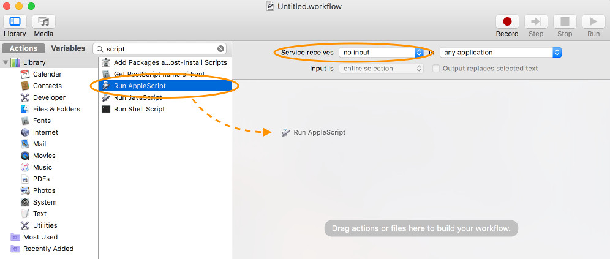
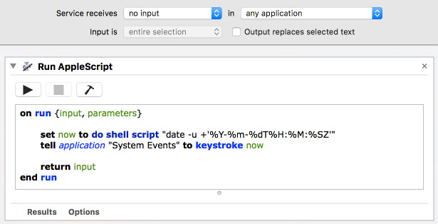
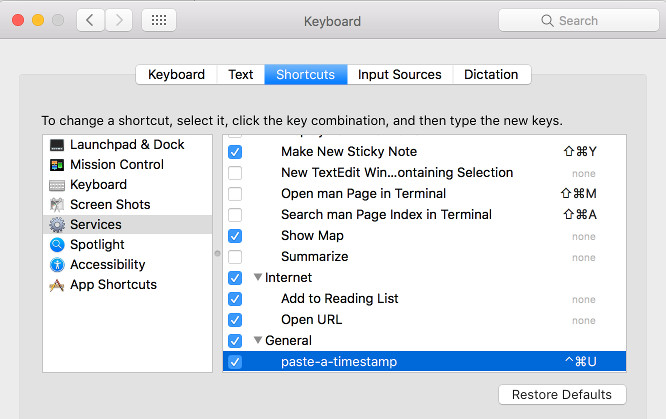
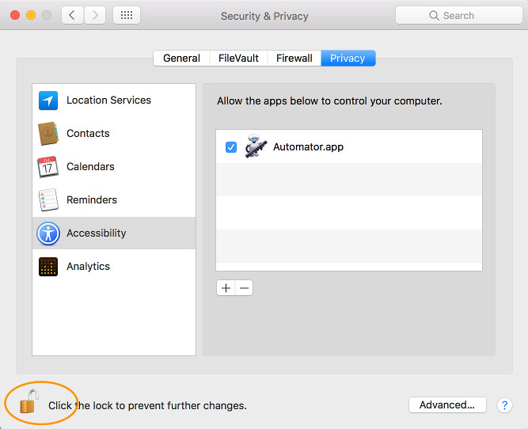

# paste-a-timestamp
`^⌘U` - because life's too short to type ISO-8601 timestamps manually

## Usage

Writing timestamps is annoying - especially when you often need to type the timestamp of _now_. 
After installing the Script and configuring the shortcut 
you can use `^⌘U` (`Shift`+`Command`+`U`) and the current timestamp gets pasted into the 
cursors position.

## Requirements

1. OSX (tested with 10.12 - Sierra) 

## Install

### Part 1 - create a service

1. open the `Automator` application
2. create a new `Service` via menu `File`, `New`
3. configure `service reveives` to `no input`
4. drag the `Run AppleScript` action into the right area  

5. paste the content of [paste-a-timestamp.scpt](paste-a-timestamp.scpt) snippet into the AppleScript 

6. save the AppleScript as `save-a-timestamp` via menu `File`, `Save`

### Part 2 - configure the shortcut

1. open the `Keybord` settings under `System Preference`
2. in tab `Shortcuts` search for the `paste-a-timestamp` service
3. double-click on the `none` text to record the shortcut you want to use - e.g. `^⌘U` (`Shift`+`Command`+`U`) 

### Part 3 - allow interaction
 
1. open the `Security & Privacy` settings under `System Preference`
2. in tab `Privacy` and setting `Accessibility` allow the `Automator` application to control your computer 
therefore open the lock in the lower-left corner 
